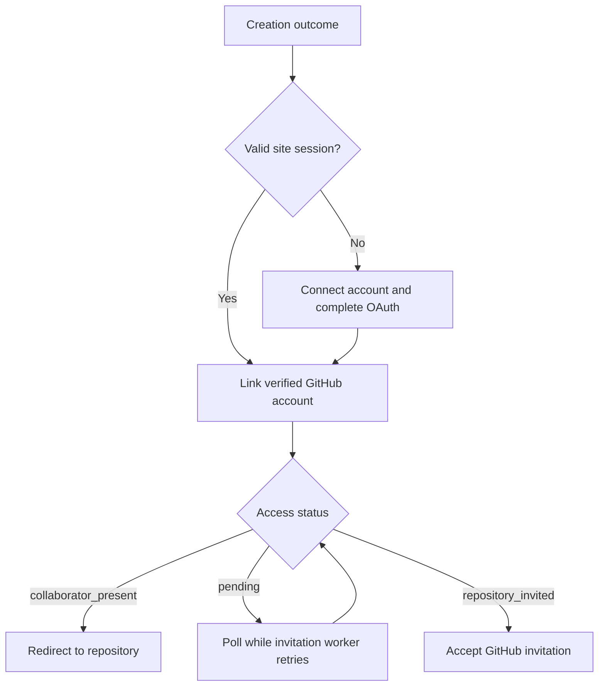

# GitHub access after app creation

Paths: `vibe-ios-app/index.js`, `vibe-ios-app/index.html`, `vibe-ios-app/index.test.cjs`.

The form email is used for Apple/TestFlight. Repository access belongs to the account
verified by GitHub OAuth, not an email or username entered into the form.
The backend binds that identity to the request; an already linked request cannot be
reassigned to another user.

| State | Result |
| --- | --- |
| Valid site session | Link the account automatically after creation. |
| Missing or expired site session | Connect GitHub account starts OAuth. GitHub requests sign-in when needed. |
| Owner or existing collaborator | Redirect to the repository in the same tab once the backend confirms `collaborator_present`. |
| Invitation pending or delayed | Stay on the result screen and poll; the backend retries sending the invitation. |
| Invitation sent | Show Accept GitHub invitation linking to the repository's `/invitations` page. Accept using the connected GitHub account. |
| Login or network error | Keep a retry action; never redirect based only on a repository URL. |

OAuth returns to the saved request, exchanges the browser-bound ticket and then fetches
the access status. Confirmed access redirects once per request in the current page.
The ordinary repository link remains available as a fallback. A pending invitation is
not treated as accepted access.

Tests: `node --test vibe-ios-app/index.test.cjs`.
Manual verification: owner with and without a site session, another GitHub account
accepting its invitation, expired session, cancelled OAuth and a delayed invitation.
